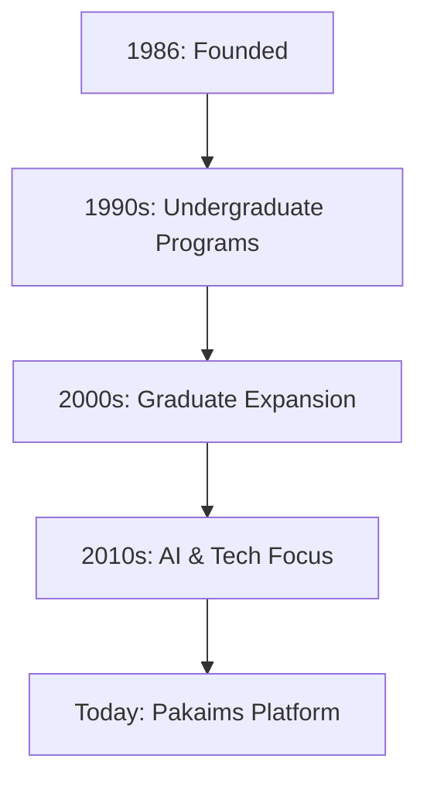

## Overview

Pakaims serves as your primary platform to explore and engage with the Institute of Management Sciences (IMS), a leading educational institution founded in 1986. You access undergraduate and graduate programs in management, computer sciences, and artificial intelligence through this intuitive interface. Pakaims connects you to IMS's rich resources, faculty expertise, and career opportunities.

<Callout kind="info">
IMS commits to innovation and excellence, equipping you with practical skills for today's competitive landscape.
</Callout>

## History and Mission

IMS established itself in 1986 as a pioneer in management and computer sciences education. Over decades, it evolved into a hub for academic rigor and industry relevance. The mission focuses on fostering critical thinking, research, and leadership. You benefit from a legacy of excellence that prepares you for global challenges.



## Key Features and Benefits

Pakaims delivers seamless access to IMS's offerings. Explore these core advantages:

<Columns cols={3}>
  <Card title="Expert Faculty" icon="users" href="#programs">
    Learn from seasoned professionals with industry experience.
  </Card>
  <Card title="Modern Infrastructure" icon="building" href="#facilities">
    Utilize state-of-the-art labs and digital resources.
  </Card>
  <Card title="Career Support" icon="briefcase" href="#connections">
    Gain internships and job placements through strong networks.
  </Card>
</Columns>

## Programs Overview

IMS offers diverse programs tailored to your career goals.

<Tabs>
  <Tab title="Undergraduate" icon="graduation-cap">
    Pursue BS in Business Administration, Computer Science, or Artificial Intelligence. These four-year programs build foundational skills with hands-on projects.
    
    <Expandable title="Admission Requirements" default-open="true">
      - Minimum 60% in intermediate exams
      - Entrance test via Pakaims
      - Interview for select disciplines
    </Expandable>
  </Tab>
  
  <Tab title="Graduate" icon="award">
    Advance with MS in Management Sciences or Data Science. These two-year programs emphasize research and specialization.
    
    <Expandable title="Specializations">
      - Business Analytics
      - Cybersecurity
      - Machine Learning
    </Expandable>
  </Tab>
</Tabs>

## International Affiliations and Industry Connections

IMS partners with top universities worldwide, enabling you to earn dual degrees and participate in exchange programs. Strong industry ties provide research opportunities, internships, and guest lectures from leaders in tech and business.

<Callout kind="tip">
Leverage Pakaims to apply for affiliated programs and track your applications in real-time.
</Callout>

## Get Started with Pakaims

Begin your IMS journey in minutes.

<Steps>
  <Step title="Create Account" icon="user-plus">
    Visit `https://pakaims.edu/register` and sign up with your email.
    
````javascript
// Example enrollment check via Pakaims API
const response = await fetch('https://api.pakaims.edu/v1/enrollments', {
  method: 'POST',
  headers: { 'Authorization': 'Bearer YOUR_API_KEY' },
  body: JSON.stringify({ program: 'BS Computer Science' })
});
````
  </Step>
  
  <Step title="Explore Programs" icon="search">
    Browse offerings and filter by discipline.
  </Step>
  
  <Step title="Apply" icon="upload">
    Submit documents through the secure portal.
  </Step>
</Steps>

## Next Steps

<Columns cols={2}>
  <Card title="Programs" icon="book-open" href="/programs">
    Dive into detailed curriculum.
  </Card>
  <Card title="Admissions" icon="clipboard-list" href="/admissions">
    Learn application process.
  </Card>
</Columns>